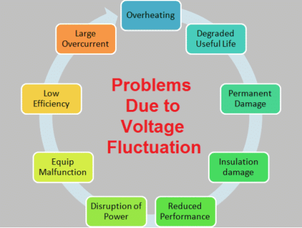
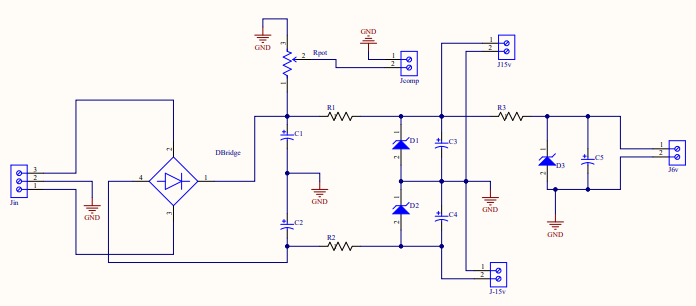
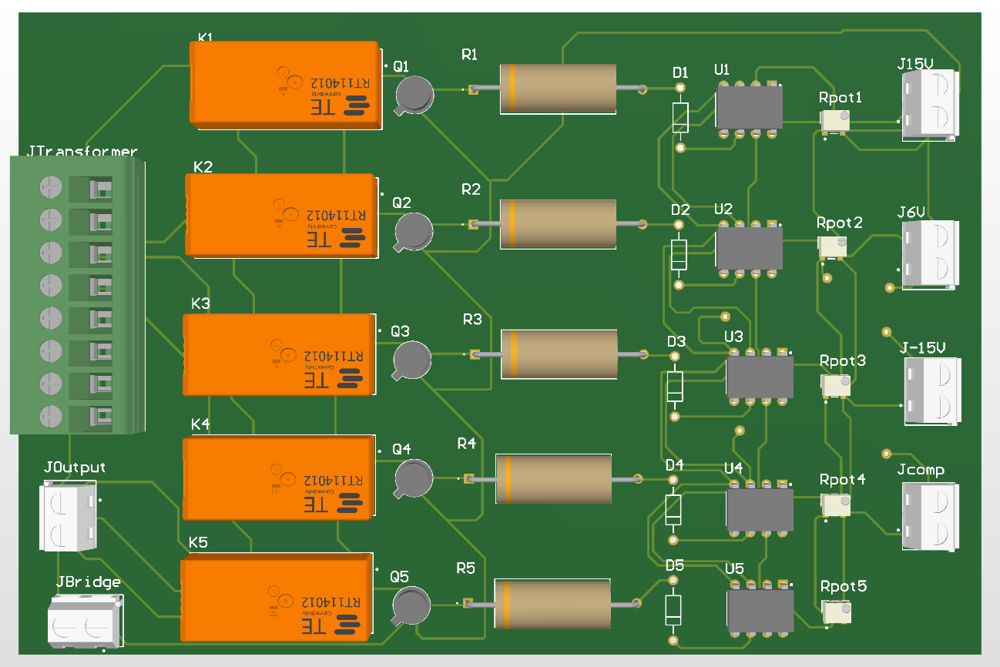

# Automatic-Voltage-Stabilizer
## Abstract
This project provides an overview of DC power supplies and relay-based voltage stabilizers, two important electrical devices used to regulate and supply power to electronic devices. The report explains how a DC power supply converts AC voltage to a stable DC voltage, and how a relay-based voltage stabilizer regulates the incoming voltage level using an autotransformer and an electromechanical relay. The report also discusses the various features and benefits of these devices and their applications in different industries. Overall, this report highlights the importance of these devices in ensuring the safe and reliable operation of electronic devices.

## Objectives
1.	To explain about the voltage stabilizer.
2.	To design and simulate an automatic voltage stabilizer.
3.	To implement and test the designed stabilizer.

## Background Theory
- A Voltage Stabilizer is an electrical device which is used to provide a constant voltage output to a load at its output terminals irrespective of any change/ fluctuation in the input i.e. incoming supply.
- The basic purpose of a Voltage Stabilizer is to protect the electrical/ electronic gadgets (for example – Air conditioning Unit, Refrigerator, TV, etc.) from the probable damage due to Voltage Surge/ fluctuations, Over Voltage and Under Voltage conditions.

### Effects of Continuous/ Recurring Over Voltage to Home Appliances:
- It may cause permanent damage to the connected device.
-	It may cause damage to the winding insulation.
-	It may lead to unnecessary disruption in the load
-	It may lead to over-heating of the cable or device.
-	It may degrade useful life of the device

### Effects of Continuous/ Recurring Under Voltage to Home Appliances:
- It may lead to equipment’s malfunction.
-	It may result in low efficiency of the device.
-	The device in some cases can take extra hours to perform the same function.
-	It may degrade performance of the device.
-	It may lead the device to draw large currents, which may further cause over-heating.

#### Voltage Stabilizer Block Diagram

### Voltage Stabilizer’s Types:
1.	Relay based voltage stabilizer
2.	Motorized (Servo) voltage stabilizer

### Relay Operated Voltage Stabilizer:
-	Relay Operated Voltage Stabilizer is meant to correct Low or High Mains Voltage and maintain the Load Voltage at ± 9 % of 230 or 240 Volts.
-	Voltage adjustment is actuated by a combination of Relay operation and Transformer tappings thereby achieving an acceptable output voltage band.
-	Output is cut off automatically if the Input mains goes beyond the limits of its range.
-	On start up, it has a time-delay function to protect the Compressor Motor against high in-rush current on restart immediately following a Cut-off or Mains failure.
-	The Compressor Motor starts only after a time -delay of 2 to 3 minutes of Mains restoration.
-	This function is especially useful where Power supply is erratic and switching on and off frequently.
-	These Stabilizers are suitable for small loads of 0.3 to 10 KVA.
-	Relay operated Automatic Voltage Regulators (AVR's) or Stabilizers are mostly used in Residential / Small Installations on Refrigeration and Air-conditioning equipment such as Window or Split AC's, Fridges, Water Coolers, Bottle Coolers, Ice-Cream Machines, Room Coolers, Dessert Coolers, Domestic Water pumps etc.
-	The output voltage is maintained within a band of 205 - 245 Volts to protect the Compressor or Pump Motor.
-	These AVR's are sometimes used on Small connection domestic Mains Supply also where cost is a prime consideration.
-	However, it is recommended to use Servo Voltage Stabilizer on Mains supply.

#### Comparator Schematic

## Required Components
1.	1 x Transformer (5 secondary tabs ranging between 180 and 260V) (5A)
2.	1 x Transformer(3 secondary tabs 9-0-9 V) (3A)
3.	5 x Relay (SPDT 24 V)
4.	5 x NPN transistor (2N2222)
5.	5 x LM741 operational amplifier
6.	6 x Potentiometer (10K)
7.	5 x Resistor (680 ohm)
8.	3 x Resistor (330 ohm 1W)
9.	2 x capacitors (470uF)
10.	1 x capacitor (10uF)
11.	2 x zener diode (15V)
12.	3 x zener diode (6 V)
13.	5 x 1N4004 diodes
14.	1 x Bridge (3A)
15.	2 x LCD Voltage Panel Display ( for input and output display)

## Schematic Representation
### Power Supply Design

#### Power Supply Schematic and Design:

1.	The incoming AC voltage is first stepped down by a transformer to a lower voltage level. This is necessary to make the voltage more manageable and safe for other components in the power supply.
2.	Rectification: The AC voltage is then rectified, or connected to DC, using a rectifier bridge. This bridge typically consists of one or more diodes, which allow current to flow in only one direction. This creates a pulsating DC voltage.
3.	Filtering: The pulsating DC voltage is then filtered using capacitors to smooth out the voltage waveform and reduce any remaining ripple.
4.	Regulation: The filtered FC voltage is then regulated using a constant voltage level using a Zener diode or a voltage regulator IC. This circuit uses feedback to adjust the output voltage as needed to maintain a stable voltage level, even under varying load conditions.
5.	Output: Finally, the regulated DC voltage is output from the power supply and can be used to power electronic devices.

In our design, the power supply is providing 3 constant DC voltages: +15V and -15V from D1 and D2 to power the Op.amps of the voltage stabilizer and 6.V as a reference for the Op.amps.

#### Power Supply PCB Layout:

#### Power Supply PCB 3D View:

### Voltage Stabilizer Design
#### Automatic Voltage Stabilizer Block Diagram:

#### Automatic Voltage Stabilizer Schematic and Design:

A relay-based voltage stabilizer works by using an electromechanical relay to switch between different taps on an autotransformer, depending on the incoming voltage level. Here's how it works:
1.	Autotransformer: The incoming AC voltage is first connected to an autotransformer, which has multiple taps along its winding. The autotransformer acts as a variable transformer and can adjust the voltage level by changing the tap connection point.
2.	Voltage sensing: A voltage sensing circuit continuously monitors the incoming voltage level and compares it to a set reference voltage. If the incoming voltage level falls outside the acceptable range, the voltage sensing circuit activates the relay.
3.	Relay operation: The activated relay switches the tap connection point on the autotransformer to a different tap with a higher or lower voltage level, depending on the incoming voltage level. This changes the output voltage level to compensate for the variation in the incoming voltage level.
4.	Output voltage: The stabilized output voltage is then supplied to the load, which can be a single device or a group of devices.
   
The relay-based voltage stabilizer can also include additional features, such as surge protection, noise filtering, and overvoltage/undervoltage protection, to ensure the safety and reliability of the connected devices.
Overall, the relay-based voltage stabilizer is a simple and reliable solution for voltage regulation and can be used in various applications such as computers, audio equipment, and other sensitive electronics.

#### Voltage Stabilizer PCB Layout:

#### Voltage Stabilizer 3D View:

#### During Implementation Phase:

#### Implementation Prototype:

## Conclusion
In conclusion, a DC power supply and a relay-based voltage stabilizer are both important electrical devices that serve specific functions in regulating and supplying power to electronic devices. A DC power supply converts AC voltage to a stable DC voltage, while a relay-based voltage stabilizer regulates the incoming voltage level using an autotransformer and an electromechanical relay. Both devices play a critical role in ensuring the safe and reliable operation of electronic devices.
